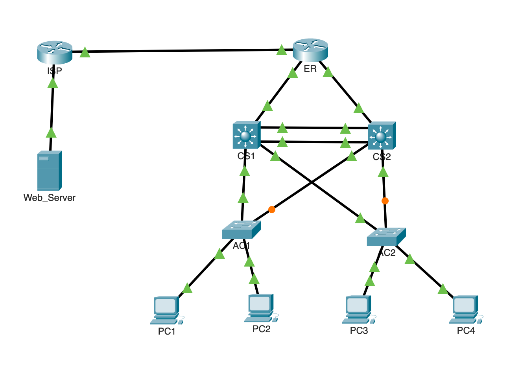

# Enterprise Multi-Switch Network Lab

## Project Overview
This project demonstrates the design, deployment, and security of a redundant, multi-switch enterprise network infrastructure using Cisco Packet Tracer. The architecture follows a hierarchical campus design ensuring high availability, traffic isolation, and secure internet edge boundaries.



## Core Technical Objectives & Implementation
*   **VLAN Segmentation & Inter-VLAN Routing:** Segregated corporate divisions into dedicated subnets (VLAN 10 Data, VLAN 20 HR/Voice, VLAN 99 Management) to reduce broadcast domains. Inter-VLAN routing was provisioned via Switch Virtual Interfaces (SVIs) on Core Multilayer Switches.
*   **High Availability & Redundancy (HSRP & EtherChannel):** Implemented an Active/Active Gateway architecture using **HSRP**. Core-01 serves as primary for VLAN 10, while Core-02 handles VLAN 20. Back-to-back Core switches are bundled via a **LACP EtherChannel** link aggregation group to maximize backbone throughput and eliminate single points of failure.
*   **Dynamic Routing (OSPF):** Configured multi-area OSPF Area 0 to dynamically distribute internal corporate routes between the Core layer and the Enterprise Edge Router. Applied `passive-interface` security on user-facing VLAN boundaries.
*   **Edge Security & Infrastructure Services:** 
    *   Deployed **PAT (NAT Overload)** on the Edge Router to map internal private IP spaces to public WAN blocks.
    *   Enforced an **Inbound Extended Access Control List (ACL)** utilizing the `established` keyword to restrict all unsolicited traffic originating from the public internet.
    *   Hardened device management lines (`line vty`) using a standard ACL to limit SSH access strictly to the Management VLAN.
    *   Hosted dynamic IP allocation directly on the core infrastructure utilizing **Cisco IOS DHCP Pools**.

## Network Verification & Troubleshooting Artifacts
The following Cisco IOS validation commands verify the operational health of the infrastructure:

### 1. EtherChannel Verification (`show etherchannel summary`)
```text
Group  Port-channel  Protocol    Ports
------+-------------+-----------+-----------------------------------------------
1      Po1(SU)         LACP      Gig1/0/1(P)   Gig1/0/2(P)
```
*(Verification: Protocol LACP is active and both ports are bundled bundled in port-channel marked "SU" - In Use).*

### 2. Gateway Redundancy Verification (`show standby brief`)
```text
                     P indicates configured to preempt.
                     |
Interface   Grp  Pri P State    Active          Standby         Virtual IP
Vlan10      10   110 P Active   local           192.168.10.3    192.168.10.1
Vlan20      20   100 P Standby  192.168.20.3    local           192.168.20.1
```
*(Verification: Proves asymmetric load balancing. Core-01 is actively managing VLAN 10 traffic and waiting in Standby for VLAN 20).*

### 3. Edge Security Verification (`show ip access-lists`)
```text
Extended IP access list OUTSIDE-IN
    10 permit tcp any any established (244 matches)
    20 permit icmp any any echo-reply (12 matches)
    30 deny ip any any log (45 matches)
```

## 🚀 How to Run the Lab
1. Download the [Enterprise_lab_packet.pkt](https://github.com/nzewdie/enterprise-network-cisco-lab/blob/main/Enterprise_lab_packet.pkt) file from the root of this repository.
2. Open the file using **Cisco Packet Tracer** (v8.2 or newer recommended).
3. Wait approximately 30 seconds for Spanning Tree Protocol (STP) and LACP to converge (all link lights will turn green).
4. Open a desktop web browser on **PC-1** or **PC-3** and navigate to `198.51.100.2` to test full Inter-VLAN routing, HSRP failover, and NAT functionality.

*(Verification: Explicitly highlights that unsolicited internet traffic is actively being denied and logged while return traffic is safely permitted).*
